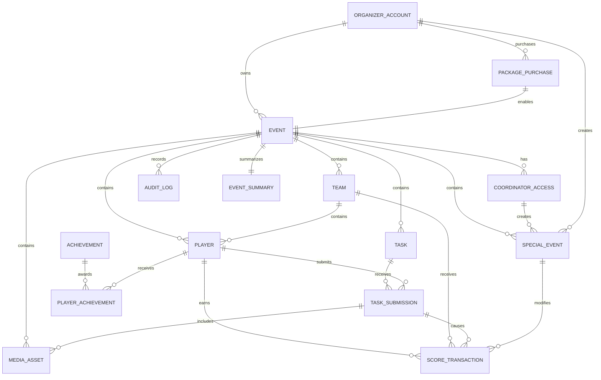

# EventQuest — ERD

## Purpose

This document describes the logical relational database model for EventQuest.

It is based on the entity definitions and relationships in the Architecture Document.

The ERD is a logical design reference. Prisma/SQL implementation may add technical fields, constraints or indexes where necessary, but must not silently change the documented business relationships.

---

## 1. Entity Relationship Diagram



---

## 2. Tables

### organizer_accounts

```text
id PK
email
password_hash
terms_accepted_at
created_at
updated_at
```

### package_purchases

```text
id PK
organizer_id FK → organizer_accounts.id
package_type
participant_limit
payment_status
payment_provider
payment_provider_session_id
purchased_at
used_at
created_at
```

Relationship:

```text
organizer_accounts 1 ── N package_purchases
```

---

### events

```text
id PK
organizer_id FK → organizer_accounts.id
package_purchase_id FK → package_purchases.id
name
event_type
room_code
status
game_mode
participant_limit
starts_at
closes_at
closed_at
created_at
updated_at
```

Relationships:

```text
organizer_accounts 1 ── N events
package_purchases 1 ── 1 event
```

`room_code` must uniquely identify an active/joinable room according to the implementation strategy.

---

### coordinator_accesses

```text
id PK
event_id FK → events.id
token_hash
is_active
expires_at
revoked_at
created_at
```

Relationship:

```text
events 1 ── N coordinator_accesses
```

---

### players

```text
id PK
event_id FK → events.id
team_id FK → teams.id nullable
nickname
avatar_url
guest_token_hash
terms_accepted_at
joined_at
last_seen_at
created_at
```

Relationships:

```text
events 1 ── N players
teams 1 ── N players
```

Business constraint:

- nickname cannot be edited after joining.

---

### teams

```text
id PK
event_id FK → events.id
name
default_number
max_players
name_changed
created_at
updated_at
```

Relationship:

```text
events 1 ── N teams
```

Business constraint:

- team name may be changed at most once.

---

### tasks

```text
id PK
event_id FK → events.id
sequence_number
title
description
teaser
task_type
points
is_active
activation_strategy
time_limit_seconds
max_submissions_per_player
starts_at
ends_at
created_at
updated_at
```

Relationship:

```text
events 1 ── N tasks
```

Recommended uniqueness:

```text
(event_id, sequence_number)
```

This enforces one sequence position per event.

---

### task_submissions

```text
id PK
event_id FK → events.id
task_id FK → tasks.id
player_id FK → players.id
team_id FK → teams.id nullable
submission_type
text_answer
quiz_answer
is_correct
status
points_awarded
submitted_at
created_at
```

Relationships:

```text
tasks 1 ── N task_submissions
players 1 ── N task_submissions
teams 1 ── N task_submissions
```

The team relation is nullable for solo mode.

---

### media_assets

```text
id PK
event_id FK → events.id
task_submission_id FK → task_submissions.id nullable
player_id FK → players.id
media_type
storage_key
public_url
thumbnail_url
file_size_bytes
duration_seconds
created_at
deleted_at
```

Relationships:

```text
events 1 ── N media_assets
task_submissions 0 ── N media_assets
players 1 ── N media_assets
```

The binary object itself is not stored in PostgreSQL.

---

### score_transactions

```text
id PK
event_id FK → events.id
player_id FK → players.id nullable
team_id FK → teams.id nullable
task_submission_id FK → task_submissions.id nullable
special_event_id FK → special_events.id nullable
points
reason
created_at
```

Relationships:

```text
players 1 ── N score_transactions
teams 1 ── N score_transactions
task_submissions 1 ── N score_transactions
special_events 1 ── N score_transactions
```

The optional relations allow both individual and team scoring.

---

### ranking_snapshots

The Architecture defines `RankingSnapshot` as a domain entity and recommends caching ranking snapshots for scalability.

The exact physical schema is intentionally not fixed by the Architecture Document.

Implementation must preserve its purpose:

- represent/capture ranking state efficiently,
- support large-event reads,
- support Big Screen Mode.

The final physical schema should be defined before production implementation.

---

### achievements

```text
id PK
code
name
description
icon
created_at
```

`code` should be unique.

---

### player_achievements

```text
id PK
event_id FK → events.id
player_id FK → players.id
achievement_id FK → achievements.id
awarded_at
```

Relationships:

```text
players 1 ── N player_achievements
achievements 1 ── N player_achievements
```

A player should not receive the same achievement more than once for the same event unless a future requirement explicitly introduces repeatable achievements.

---

### special_events

```text
id PK
event_id FK → events.id
type
title
description
multiplier
starts_at
ends_at
created_by_coordinator_access_id FK → coordinator_accesses.id nullable
created_by_organizer_id FK → organizer_accounts.id nullable
created_at
```

Relationships:

```text
events 1 ── N special_events
coordinator_accesses 1 ── N special_events
organizer_accounts 1 ── N special_events
```

Exactly one creator actor should be associated with a created special event.

---

### ai_generated_task_sets

The Architecture defines `AiGeneratedTaskSet` as a domain entity but does not provide a complete physical field list.

The implementation should preserve:

```text
event/task generation context
generated task set
special event suggestions
point suggestions
generation metadata
```

The exact schema should be finalized when AI task generation is implemented.

---

### event_summaries

```text
id PK
event_id FK → events.id
ai_summary_text
report_url
media_package_url
generated_at
downloaded_at
created_at
```

Relationship:

```text
events 1 ── 1 event_summaries
```

---

### audit_logs

```text
id PK
event_id FK → events.id
actor_type
actor_id
action
metadata_json
created_at
```

Relationship:

```text
events 1 ── N audit_logs
```

---

## 3. Important Indexes

The Architecture explicitly recommends indexes on:

```text
events.room_code

players.event_id
players.team_id

tasks.event_id
tasks.sequence_number

task_submissions.event_id
task_submissions.task_id
task_submissions.player_id

media_assets.event_id

score_transactions.event_id
score_transactions.player_id
score_transactions.team_id

special_events.event_id
```

Additional indexes may be added when justified by query patterns.

Do not remove required indexes without an explicit architectural reason.

---

## 4. Important Constraints

### Package/event

```text
package_purchase 1 → 1 event
```

A package purchase cannot be consumed by multiple events.

### Event ownership

```text
event.organizer_id → organizer_accounts.id
```

Organizer access must be restricted to owned events.

### Team membership

Player's `team_id` must reference a team belonging to the same event.

### Task ownership

Task belongs to the event in which it is played.

### Submission ownership

A submission's:

- event,
- task,
- player,
- team

must be consistent.

### Media ownership

Media must belong to the same event as its player/submission.

### Score ownership

Score transactions must be associated with the same event as their player/team/submission/special event.

---

## 5. Event-Scoped Data

Most gameplay entities are event-scoped.

The event is the primary isolation boundary for:

- players,
- teams,
- tasks,
- submissions,
- media,
- scores,
- achievements,
- special events,
- logs.

AI agents must treat cross-event data access as a security-sensitive operation.

---

## 6. Data Retention

Media:

```text
maximum 30 days
```

Earlier deletion:

```text
report generated
→ media package prepared
→ organizer downloads
→ media deleted
```

Keep:

- technical logs,
- event logs,
- statistics,
- ranking summaries,
- task statistics,
- score transactions.

---

## 7. Storage Boundary

PostgreSQL stores metadata and domain state.

Object Storage stores:

- photos,
- videos,
- generated media packages where applicable.

Do not store large binary media directly in PostgreSQL.

---

## 8. Future-Compatible Areas

The Architecture deliberately leaves some physical details open:

- exact RankingSnapshot schema,
- exact AiGeneratedTaskSet schema,
- full SQL constraints,
- some generated report storage details.

These should be resolved in implementation-specific documentation before those features are built, rather than invented ad hoc by an AI agent.
